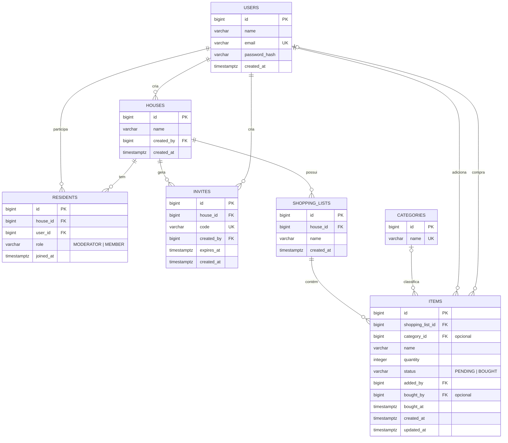

# Modelo de Dados — PoeNaLista

Modelo relacional que atende as histórias do MVP (#1 a #6). O schema é criado **somente por migrations Flyway** (`src/main/resources/db/migration/`); o Hibernate apenas valida que as entidades batem com as tabelas (`spring.jpa.hibernate.ddl-auto=validate`).

Diagrama editável: [`modelo-de-dados.drawio`](modelo-de-dados.drawio) (abre em [app.diagrams.net](https://app.diagrams.net) ou na extensão Draw.io do VS Code).

## Convenção de nomes

- Tabelas, colunas, constraints e valores de enum em **inglês**, em `snake_case`; tabelas no **plural** (`users`, `houses`...). O plural também evita `user`, palavra reservada no PostgreSQL.
- Classes e campos Java em inglês, espelhando o banco (`User` ↔ `users`, `createdAt` ↔ `created_at`).
- Constraints nomeadas: `pk_`, `fk_<tabela>_<coluna>`, `uk_<tabela>_<colunas>`, `ck_<tabela>_<coluna>`, índices `ix_<tabela>_<colunas>`.
- Dados exibidos ao usuário (ex.: nomes de categorias) continuam em português.

## Diagrama

## Dicionário de dados

| Tabela | Entidade Java | Finalidade | História | Restrições relevantes |
|---|---|---|---|---|
| `users` | `user.User` | Conta de quem usa o app | #1 | `email` único; guarda só o **hash** da senha |
| `houses` | `house.House` | Casa: grupo de moradores que compartilha listas | #2 | `created_by` → `users` |
| `residents` | `house.Resident` | Morador: vínculo usuário ↔ casa, com papel | #2, #6 | `(house_id, user_id)` único; `role` ∈ {`MODERATOR`, `MEMBER`} |
| `invites` | `house.Invite` | Convite: código para entrar em uma casa | #2 | `code` único; `expires_at` define a validade |
| `shopping_lists` | `shoppinglist.ShoppingList` | Lista de compras de uma casa (uma casa pode ter várias) | #1, #3 | `(house_id, name)` único |
| `categories` | `item.Category` | Categoria de produto (Limpeza, Frios...) | MVP | `name` único; carga inicial pela migration `V2` |
| `items` | `item.Item` | Item de uma lista | #3, #4, #5 | `status` ∈ {`PENDING`, `BOUGHT`}; `quantity > 0`; índice `(shopping_list_id, status)` |

## Decisões de modelagem

- **Várias listas por casa**: a tabela `shopping_lists` fica entre `houses` e `items`, permitindo listas como "Mercado" e "Feira". A classe se chama `ShoppingList` para não conflitar com `java.util.List`.
- **Convite por código**: quem recebe o código entra na casa; não depende de envio de e-mail.
- **Categorias em tabela**: novas categorias entram por migration, sem mudar código Java. `category_id` é opcional no item.
- **Papel do morador**: quem cria a casa vira `MODERATOR`; prepara a história #6 sem precisar de migration de alteração depois.
- **`bought_by` / `bought_at`**: registram quem colocou o item no carrinho (#5).
- **Exclusão em cascata**: apagar uma casa apaga seus moradores, convites e listas; apagar uma lista apaga seus itens. Referências a `users` não têm cascata.
- **Tipos portáveis**: `BIGINT GENERATED BY DEFAULT AS IDENTITY` e `TIMESTAMP WITH TIME ZONE` funcionam igual no PostgreSQL (produção) e no H2 em modo PostgreSQL (desenvolvimento e testes).
- **Relacionamentos só de ida nas entidades** (`@ManyToOne` com `LAZY`): coleções `@OneToMany` são adicionadas pelos cartões de CRUD quando houver necessidade real.

## Regras para migrations

1. Arquivos em `src/main/resources/db/migration/`, nomeados `V<n>__description_in_snake_case.sql`.
2. **Migration já integrada na `main` nunca é editada**: qualquer mudança no schema é uma nova `V<n+1>__...`.
3. Toda mudança de schema vem acompanhada da mudança na entidade no mesmo PR; o teste `MapeamentoEntidadesTest` (com `ddl-auto=validate`) falha se as duas divergirem.
4. Usar SQL compatível com PostgreSQL e H2 (evitar tipos e funções exclusivas de um dos bancos).
5. Atualizar este documento e o `.drawio` junto com a migration.

| Versão | Descrição |
|---|---|
| `V1__create_tables.sql` | Cria as 7 tabelas, chaves, restrições e índices |
| `V2__seed_categories.sql` | Insere as categorias iniciais |
